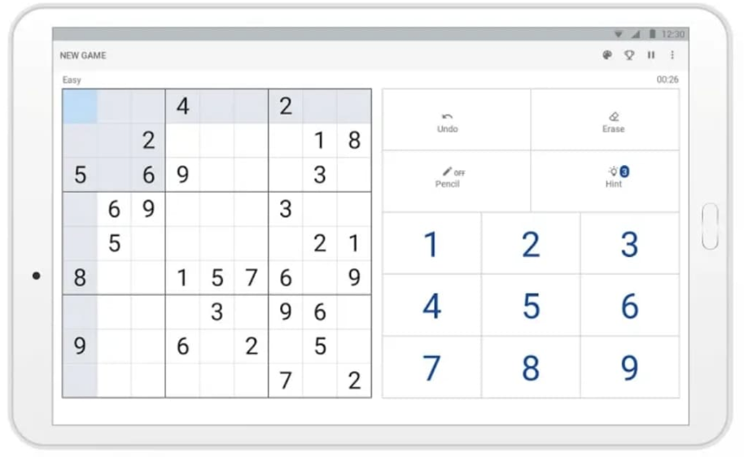

# MARKDOWN SUDOKU VOCABULARY

## **FOR ITERATION 1**

## 1. SUDOKU DUPLICATE IDENTIFIER

### Status: **Implemented**

### `User Story`

- As a beginner in Sudoku, I want to be able to quickly see if I have inputted duplicate words, so that I can quickly fix the mistake

### `Test Driven Development`

- When a beginner in Sudoku inputs a duplicate entry either in the row or column or the 3x3 box, the duplicates will be highlighted in red.

## 2. BOLDED PRE-FILLED WORDS

### Status: **Implemented**

### `User Story`

- As a user, I want to be able to differentiate between pre-filled cells and the cells that I filled out

### `Test Driven Development`

- When a user tries to change a pre-filled cell, a toast will state that the pre-filled cell cannot be changed and the pre-filled cells will be bolded

## 3. UNIQUE PUZZLES

### Status: **Implemented**

### `User Story`

- As a user, I want to play a unique game each time so that the games will be different each time

### `Test Driven Development`

- When a user starts a game, a unique Sudoku board will be generated each time the user starts a game

## 4. MAIN MENU

### Status: **Implemented**

### `User Story`

- As a user, I want to see a main menu so that I can choose when to start my game

### `Test Driven Development`

- When a user opens the app, a main menu will be presented to the user so that the user can decide when to start the game

## 5. TIMER

### Status: **Implemented**

### `User Story`

- As a user, I want to be able to know how long it took me to solve the Sudoku puzzle, so that I can try to improve for next time and see how much time has elapsed

### `Test Driven Development`

- When a user starts a Sudoku puzzle, a timer is initiated and displayed above the Sudoku board

## 6. WORD TRANSLATION HINTS

### Status: **Implemented**

### `User Story`

- As a language learner, I want to be able to peek at the translation of the pre-filled cell so that I can remind myself what the translation is

### `Test Driven Development`

- When a user presses and hold a Sudoku cell from the app on the phone, the translation of that word is momentarily displayed and a vibration will let the user know that the hint is displayed

- When user selects a Sudoku cell from the Android Studio Emulator, the users mouse pointer must slightly move within the cell for the hint to popup 

## 7. FINISH SCREEN

### Status: **Implemented**

### `User Story`

- As a user, I want to be able to know when I complete a puzzle, so that I can stop with the puzzle and move on

### `Test Driven Development`

- When a user completes the board, the user can click the "check" button and if the board is correct, a victory toast will pop up and a victory sound file will play.

- When a user does not complete the board, if the user clicks the "check" button, a toast will prompt the user that the puzzle is not completed

## 8. APP ICON

### Status: **Implemented**

### `User Story`

- As a user, I want to see a unique icon for the app rather, so that it looks nicer than the default icon

### `Test Driven Development`

- When a user decides to open the app, a unique icon will be displayed rather than the default Android icon

## 9. Difficulty Settings

### Status: **Implemented**

### `User Story`

- As a user, I want to be able to choose the difficulty of the Sudoku puzzle, so that I can either challenge myself or make it easier for myself.

### `Test Driven Development`

- When a user opens a board, the app will prompt the user with a seeking bar, so that the user can choose the difficulty of the board.

## **FOR ITERATION 2**

## 10. NIGHT MODE

### Status: **Not Started**

### `User Story`

- As a user, I want to be able to play in the dark, so that I don't have to strain my eyes while playing the game

### `Test Driven Development`

- When a user clicks the night mode button, the colours of the app will change to a darker scheme

## 11. LANDSCAPE MODE

### Status: **Not Started**

### `User Story`

- As a user, I want to be able to play the game in landscape mode, so that I can play while laying on my side

### `Test Driven Development`

- When a user rotates the screen orientation to landscape, the app will rotate accordingly with readjustments to board and button locations

- Ex. 

## 12. CSV READER

### Status: **Not Started**

### `User Story`

- As a teacher, I want to specify a list of word pairs via a CSV file for my students to practice this week

### `Test Driven Development`

- When a teacher selects the "import word list" button from the main menu, the teacher will be prompted to find the CSV file that contains the 9 (or 10) pairs of words and prompted to enter the name of the 2 languages. The program will then generate a Sudoku board using the user inputted nine pair of words

## 13. PAUSE

### Status: **Not Started**

### `User Story`

- As a user, I want to be able to pause the timer, so that I can do other important tasks

### `Test Driven Development`

- When a user touches the "pause" button, the timer will pause and a "pause screen" will be displayed (it should be big enough to block the board)

## 14. BACK (TO MENU) BUTTON

### Status: **Not Started**

### `User Story`

- As a user, I want to be able to go back to the menu screen, so that I can go back to the menu to choose other options

### `Test Driven Development`

- When a user clicks a "back" button, the game they are currently on should be saved or prompted that progress will be lost and then returned to the menu screen

## 15. ERASE BUTTON

### Status: **Not Started**

### `User Story`

- As a user, I want to be able to erase a cell that I accidentally filled with the wrong word

### `Test Driven Development`

- When a user wants to erase a filled cell, the user will select the desired cell to be erased and click the erase button

## 16. HOW-TO-PLAY BUTTON

### Status: **Not Started**

### `User Story`

- As a beginner to Sudoku, I want to know the rules of the game

### `Test Driven Development`

- When a beignner to Sudoku selects the "help button," a popup will explain the rules to Sudoku and pausing the timer of the game. (Help button in Main Menu and in-game?)

## 17. SAVED BOARDS

### Status: **Not Started**

### `User Story`

- As a user, I want to be able to save my progress for the current puzzle for the future and when I return to the main menu

### `Test Driven Development`

- When a user decided to exit the current board, the user will be prompted with a message if they want to save the board or not. There will be an option in the main menu for users who want to return to a saved board.

## 18. BETTER VICTORY DETECTION

### Status: **Not Started**

### `User Story`

- As a user, I don't want to have to click the "check" button after I have completed the game

### `Test Driven Development`

- When a user plays the Sudoku game, the game will automatically check if the board is completed or not rather than having the user to press the button

## **REFERENCES**

- Code from https://github.com/Subh0m0y/Sudoku/blob/master/src/core/Generator.java by Subh0m0y was referenced when implementing feature three (Unique Puzzles)